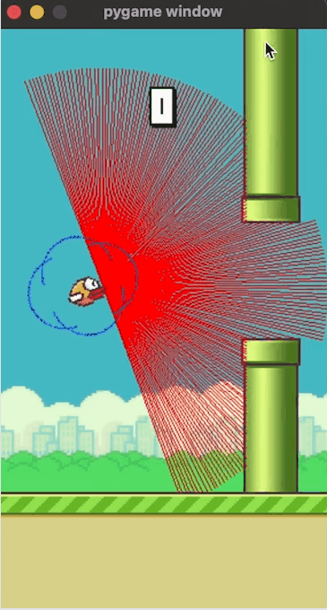

# Flappy Bird — Deep Q-Network (DQN) Reinforcement Learning Agent

An AI agent that learns to play Flappy Bird using **Deep Q-Learning (DQN)** with experience replay.

## 🎮 Overview

This project trains a reinforcement learning agent to play a custom Flappy Bird environment. The agent observes the game state, takes actions (flap / no flap), and learns an optimal policy over time using a Deep Q-Network trained on experiences sampled from a replay buffer.

## 📁 Project Structure

```
flappy-bird-dqn/
├── agent.py                # Main agent: training loop, action selection, model updates
├── dqn.py                  # DQN neural network architecture
├── experience_replay.py    # Replay buffer for storing and sampling transitions
├── game_flappy_bird.py     # Flappy Bird game environment
├── parameters.yaml         # Hyperparameters and configuration
├── runs/                   # Saved training runs, logs, model checkpoints (ignored in git)
├── requirements.txt        # Python dependencies
└── README.md
```

## ⚙️ Requirements

- Python 3.9+
- Dependencies listed in `requirements.txt` (e.g. `torch`, `numpy`, `pygame`, `pyyaml`)

Install with:
```bash
pip install -r requirements.txt
```

## 🚀 Usage

**Train the agent:**
```bash
python agent.py flappybirdv0 --train
```

**Run/test a trained agent:**
```bash
python agent.py flappybirdv0
```

> Update the exact command-line flags above to match how `agent.py` is actually invoked in your code.

## 🧠 Configuration

All hyperparameters (learning rate, discount factor, epsilon decay, replay buffer size, batch size, etc.) are defined in `parameters.yaml`, so you can tune training without touching the code.

## 📊 Results

The trained agent playing Flappy Bird:



## 📝 How It Works

1. **`game_flappy_bird.py`** — Simulates the Flappy Bird environment and returns state, reward, and done signals.
2. **`dqn.py`** — Defines the neural network that approximates Q-values for each action given a state.
3. **`experience_replay.py`** — Stores past transitions `(state, action, reward, next_state, done)` and samples random batches to break correlation between consecutive experiences.
4. **`agent.py`** — Orchestrates training: interacts with the environment, stores experiences, samples batches, and updates the DQN via backpropagation.

